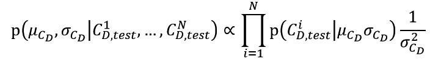

## Statistical Calibration and Validation of Mathematical Model to Predict Motion of Paper Helicopter

### Introduction

To understand physical phenomena, mathematical models are broadly used to reduce experiment expenses. However, due to simplified assumptions and uncertain parameters, there are bound to be differences from the actual phenomena. In this study, statistical calibration and validation are used to compare mathematical results and experimental measurements. Paper helicopter experiments are conducted as an actual phenomenon example. Fall time is measured with three nominally identical paper helicopters. The drag coefficient, the single unknown parameter of the two mathematical models, is quantified using Bayesian Calibration. Predicted fall time data is presented in the form of probability distributions. The mathematical  models are validated by comparing predicted distribution and experimental data distribution. In addition, Analysis of Variance test is used to compare manufacturing and experimental error. All three paper helicopters are regarded as one identical model.

|Contingency table|Generative model|
|:--:|
||
||

### Conclusion

In this study, statistical methods were used to validate mathematical models predicting motion of paper helicopters. It was beneficial to use paper helicopters for its economical nature and easy production. Also, their analytical model is relatively simple, which means statistical techniques could be applied effectively. Fall time is measured in four different conditions, and one of the conditions is used for calibration to predict fall time of the other three conditions. The three conditions were used to validate the performance of the prediction. 
Three nominally identical helicopters are considered as one identical model with Analysis of Variance (ANOVA) test result. The uncertainty of a single parameter is quantified through Bayesian calibration so that estimated fall time of helicopters was predicted in the form of distribution. Markov chain Monte Carlo (MCMC) technique is applied to generate samples from posterior distributions. Predictive validation was conducted by comparing distributions of actual fall time and predicted fall time. The result showed the validity of two mathematical models. The quadratic model demonstrated better performance for weight and height changes. On the other hand, the linear model showed poor prediction with weight change.
In this paper, statistical calibration and validation are applied to mitigate the difference between actual phenomena and mathematical prediction model. Future work will extend the present single parameter to more parameters through additional experiments for optimization.
